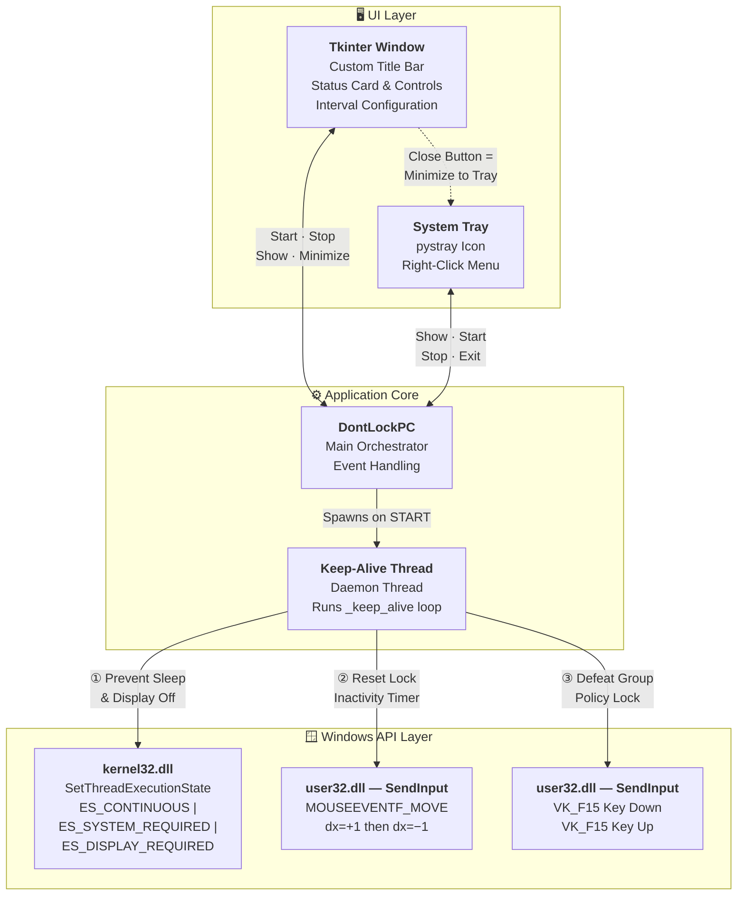
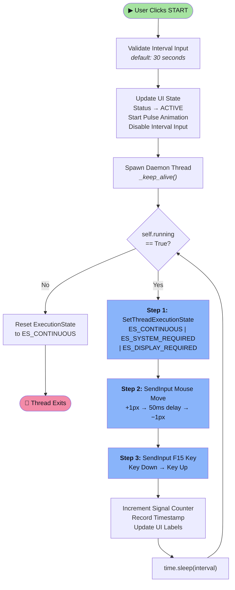
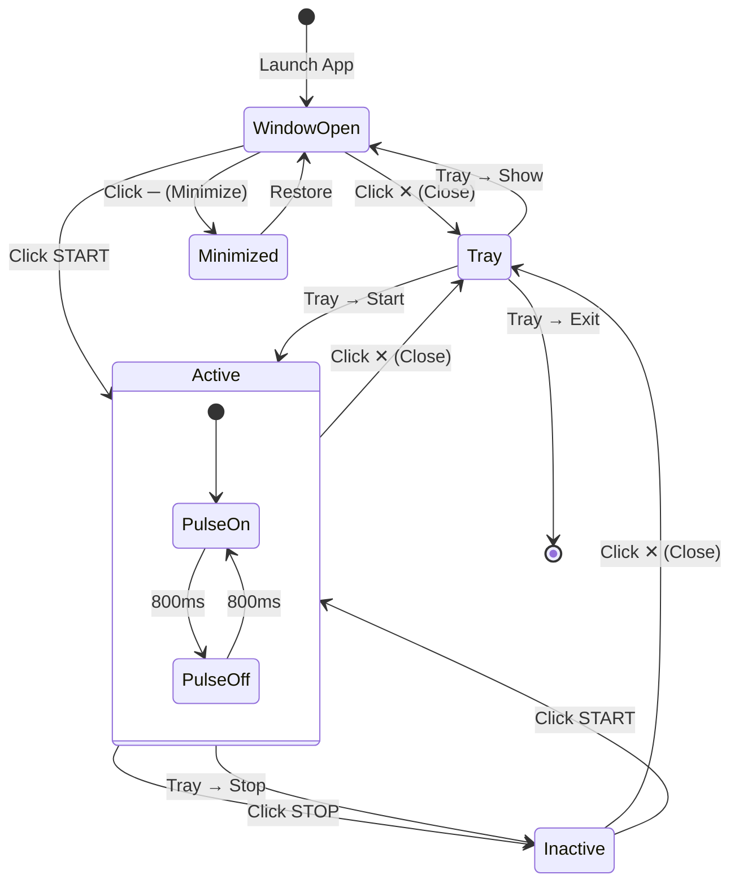

# ⚡ Don't Lock My PC

**A lightweight Windows utility that prevents your PC from locking, sleeping, or turning off the display — even under Group Policy restrictions.**


---

## Overview

Corporate and enterprise environments often enforce aggressive screen lock and sleep policies via Group Policy. **Don't Lock My PC** defeats these lockouts using a triple-layer keep-alive strategy that operates at the hardware input level — making it effective where simpler tools fail.

### Why Three Mechanisms?

| Mechanism | What It Does | Why It's Needed |
|---|---|---|
| `SetThreadExecutionState` | Tells the Windows kernel not to sleep or turn off the display | Prevents OS-level sleep but **does not** reset the lock inactivity timer |
| `SendInput` — Mouse Move | Moves the mouse ±1 pixel via hardware-level input | Resets the user inactivity timer that triggers screen lock |
| `SendInput` — F15 Keypress | Simulates an invisible F15 key press/release | Defeats Group Policy lock timers; F15 has no visible side effects |

---

## Features

- **Catppuccin Mocha Dark UI** — Frameless, draggable window with a modern dark theme
- **System Tray Integration** — Minimizes to tray on close; right-click tray icon for quick actions
- **Configurable Interval** — Set the keep-alive signal frequency (default: 30 seconds)
- **Live Status Dashboard** — Pulse animation, signal counter, and last-signal timestamp
- **Zero Footprint** — Uses the invisible F15 key and ±1px mouse moves; no visible interference
- **Start/Stop Controls** — One-click activation with clear ACTIVE/INACTIVE status

---

## Architecture



---

## Keep-Alive Flow



---

## UI Interaction Flow



---

## Installation

### Prerequisites

- **Python 3.x** (tested on 3.10+)
- **Windows** (uses Win32 API via `ctypes` — not compatible with macOS/Linux)

### Steps

```bash
# Clone or download the project
cd DontLockPC

# Install dependencies
pip install -r requirements.txt
```

Dependencies (`requirements.txt`):
- `pystray` — System tray icon and menu
- `Pillow` — Tray icon image generation

> `tkinter` and `ctypes` are included with Python on Windows — no extra install needed.

---

## Usage

```bash
python dont_lock_pc.py
```

| Action | Behavior |
|---|---|
| **START** | Begins sending keep-alive signals at the configured interval |
| **STOP** | Halts all keep-alive signals and resets Windows execution state |
| **Close (✕)** | Minimizes to system tray (does **not** exit) |
| **Minimize (─)** | Standard window minimize to taskbar |
| **Tray → Show** | Restores the window from tray |
| **Tray → Exit** | Fully quits the application |
| **Interval field** | Set signal frequency in seconds (editable when stopped) |

---

## How It Works

The app uses a **background daemon thread** that loops while active, executing three complementary Windows API calls each cycle:

1. **`kernel32.SetThreadExecutionState`** — Sets flags `ES_CONTINUOUS | ES_SYSTEM_REQUIRED | ES_DISPLAY_REQUIRED` to inform the OS that the system and display are in use. This prevents automatic sleep and display power-off but does **not** prevent screen lock.

2. **`user32.SendInput` (Mouse)** — Injects a hardware-level mouse move of +1 pixel followed by −1 pixel (with a 50ms gap). This resets the user inactivity timer that Windows uses to trigger screen lock, without visibly moving the cursor.

3. **`user32.SendInput` (Keyboard)** — Simulates an F15 key press and release. F15 is a valid USB HID key code that Windows recognizes as user input but no application acts on — making it invisible. This provides an additional inactivity timer reset that works even when Group Policy ignores mouse input.

When stopped, the app calls `SetThreadExecutionState(ES_CONTINUOUS)` to restore the default power behavior.

---

## Project Structure

```
DontLockPC/
├── dont_lock_pc.py      # Single-file application (all logic)
├── requirements.txt     # Python dependencies (pystray, Pillow)
└── README.md            # This file
```

---

## Limitations

- **Windows only** — Relies on `ctypes` calls to `kernel32.dll` and `user32.dll`
- **No admin rights needed** — Runs in user space, but effectiveness may vary under heavily locked-down environments
- **Mouse jitter** — The ±1px mouse move is imperceptible but technically moves the cursor

---

## Disclaimer

This tool is intended for **personal productivity use** — keeping your own workstation awake during long-running tasks, presentations, or remote sessions. Always comply with your organization's IT policies regarding workstation management.

---

<p align="center">
  <b>Built with Python + Tkinter</b><br/>
  <sub>Catppuccin Mocha theme • System tray powered by pystray</sub>
</p>
