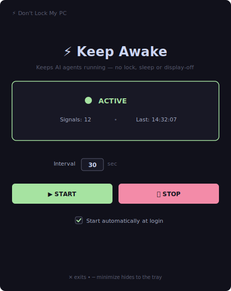
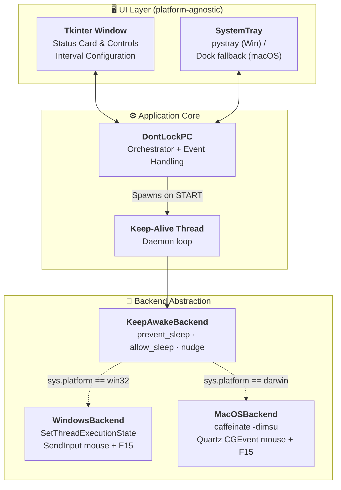
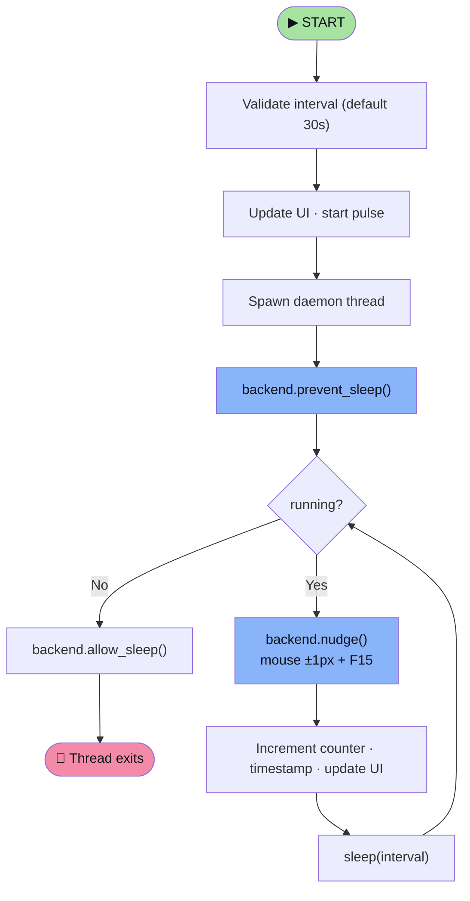

# ⚡ Don't Lock My PC

**Keep your computer awake and unlocked while long-running AI agents do the work.**

When you kick off an AI agent, coding assistant, or any long task and step away,
Windows/macOS often lock the screen or go to sleep — pausing or interrupting the
run. **Don't Lock My PC** keeps your session alive so agents keep working
uninterrupted, then lets the machine sleep normally when you stop it.

> **Motto:** *While AI agents are working, your system should never lock or sleep.*

<p align="center">
  
</p>


---

## Overview

**Why this exists:** AI agents and automated workflows often run for many
minutes or hours. If you walk away, corporate/personal lock and sleep policies
kick in — locking the screen, sleeping the machine, or turning off the display —
which can pause the agent, drop RDP/remote sessions, or interrupt the task. Run
this app before you start a long agent run and it keeps everything awake until
you click **STOP**.

**Don't Lock My PC** keeps your session alive using OS-native,
side-effect-free "keep-awake" signals — a tiny mouse nudge and an invisible
**F15** keypress — combined with the platform's official sleep-prevention API.

The UI is identical on every platform; all OS-specific logic lives behind a
small backend abstraction that is selected automatically at runtime.

### Keep-alive mechanisms per platform

| Platform | Prevent sleep / display off | Reset lock / inactivity timer |
|---|---|---|
| **Windows** | `SetThreadExecutionState` (`ES_SYSTEM_REQUIRED` \| `ES_DISPLAY_REQUIRED`) | `SendInput` mouse ±1px + invisible **F15** keypress |
| **macOS** | built-in `caffeinate -dimsu` subprocess | Quartz `CGEvent` mouse ±1px + invisible **F15** keypress |

> Windows' `SetThreadExecutionState` prevents sleep but does **not** reset the
> screen-lock timer — that is why the mouse + F15 nudge is also needed. On
> macOS, `caffeinate` handles sleep while the Quartz events keep the session
> active.

### Typical use cases

- Running an **AI coding agent** or automation that takes many minutes/hours
- Long **model training / inference / data jobs** you monitor remotely
- Keeping an **RDP / remote-desktop** session from locking mid-task
- Presentations, downloads, or any unattended long-running process

---

## Features

- **Built for long AI-agent runs** — start it before a lengthy agent/automation
  task so the session never locks or sleeps mid-run
- **Cross-platform** — one codebase for Windows and macOS
- **Catppuccin Mocha dark UI** — clean, modern Tkinter interface
- **System-tray integration** on Windows (minimizes to tray on close); graceful
  minimize-to-Dock fallback on macOS
- **Configurable interval** — set the keep-alive frequency (default: 30s)
- **Start at login** — optional autostart (Windows registry `Run` key / macOS
  LaunchAgent) so it's ready before your next agent run
- **Live status dashboard** — pulse animation, signal counter, last-signal time
- **Zero footprint** — invisible F15 key and ±1px mouse moves; no interference
- **Proper Python packaging** — `pip install .`, `dontlockpc` console command

---

## Installation

### Prerequisites

- **Python 3.9+**
- **Windows** or **macOS**
- Tkinter (bundled with the official Python installers; on macOS via Homebrew
  use `brew install python-tk`)

### Install

```bash
# Clone the repository
git clone https://github.com/mahanteshimath/do-not-lock-my-system.git
cd do-not-lock-my-system

# (recommended) create a virtual environment
python -m venv .venv
# Windows:  .venv\Scripts\activate
# macOS:    source .venv/bin/activate

# Install the package and its dependencies
pip install .
```

On macOS, the install pulls in `pyobjc-framework-Quartz` automatically (via
platform markers) so the mouse/F15 nudge works. `caffeinate` is built into
macOS — no extra install needed.

---

## Usage

Run it any of these ways:

```bash
dontlockpc              # console entry point (after install)
python -m dontlockpc    # run the package
python dont_lock_pc.py  # legacy launcher (compatibility shim)
```

| Action | Behavior |
|---|---|
| **START** | Begins sending keep-alive signals at the configured interval |
| **STOP** | Halts signals and restores default power/idle behavior |
| **Close (✕)** | Windows: minimizes to tray · macOS: minimizes to Dock |
| **Interval field** | Signal frequency in seconds (editable when stopped) |
| **Start automatically at login** | Toggles autostart (Windows `Run` key / macOS LaunchAgent) |
| **Tray → Show/Start/Stop/Exit** | Quick actions (Windows) |

---

## Build a standalone executable

Ship it without requiring Python on the target machine using
[PyInstaller](https://pyinstaller.org/). Build on the OS you want to target
(PyInstaller does not cross-compile):

```bash
pip install .[dev]        # includes pyinstaller
pyinstaller dontlockpc.spec
```

The bundled app appears in `dist/`:

- **Windows** → `dist/DontLockMyPC.exe` (windowed, no console)
- **macOS** → `dist/DontLockMyPC.app`

---

## Project structure

```
do-not-lock-my-system/
├── src/dontlockpc/
│   ├── __init__.py          # package metadata / version
│   ├── __main__.py          # `python -m dontlockpc`
│   ├── app.py               # Tkinter UI + keep-alive orchestrator
│   ├── autostart.py         # cross-platform "run at login" management
│   ├── tray.py              # system-tray wrapper (graceful degradation)
│   └── backends/
│       ├── __init__.py      # get_backend() platform factory
│       ├── base.py          # KeepAwakeBackend abstract interface
│       ├── windows.py       # Win32 ctypes implementation
│       └── macos.py         # caffeinate + Quartz implementation
├── tests/test_backends.py   # backend factory + contract tests
├── docs/screenshot.svg      # UI preview used in this README
├── .github/                 # CI workflow, issue/PR templates
├── dont_lock_pc.py          # legacy launcher shim
├── dontlockpc.spec          # PyInstaller build spec (standalone exe/app)
├── pyproject.toml           # packaging + tooling config
├── requirements.txt         # runtime deps (with platform markers)
├── requirements-dev.txt     # dev deps (ruff, pytest)
├── LICENSE                  # MIT
├── CONTRIBUTING.md
├── CODE_OF_CONDUCT.md
├── CHANGELOG.md
└── README.md
```

---

## Architecture



---

## Keep-alive flow



---

## Development

```bash
pip install -e ".[dev]"

ruff check .          # lint
ruff format .         # format
pytest                # tests
```

See [CONTRIBUTING.md](CONTRIBUTING.md) for details, including how to add a new
platform backend.

---

## Limitations

- **Windows & macOS only.** The backend abstraction makes Linux support
  straightforward to add later (planned) — contributions welcome.
- **macOS system tray:** `pystray`'s macOS backend must run on the main thread,
  which conflicts with Tkinter. To stay stable, the app minimizes to the Dock
  on macOS instead of a menu-bar tray.
- **Mouse jitter:** the ±1px mouse move is imperceptible but technically moves
  the cursor.
- Effectiveness may vary under heavily locked-down enterprise policies.

---

## License

[MIT](LICENSE) © Don't Lock My PC contributors
