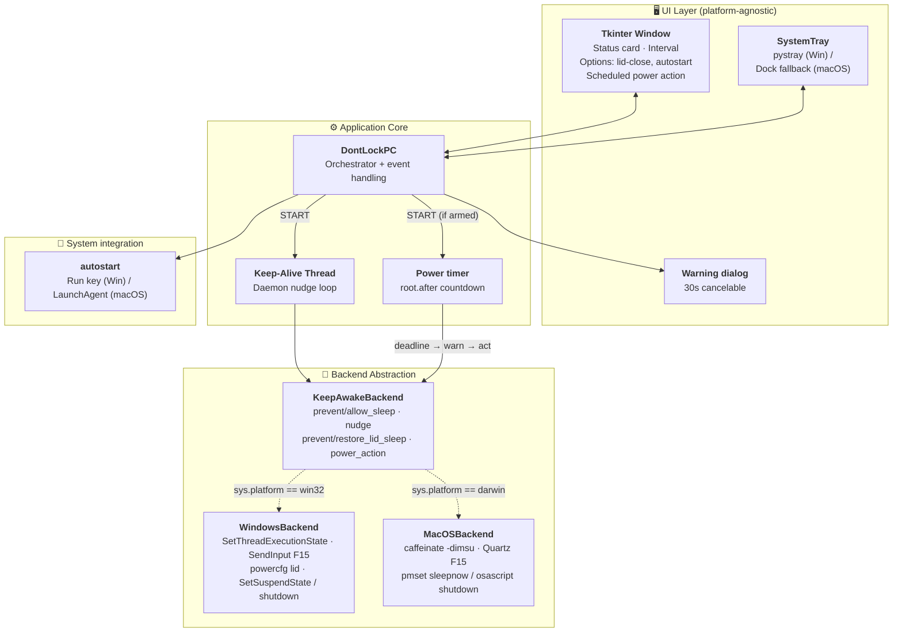
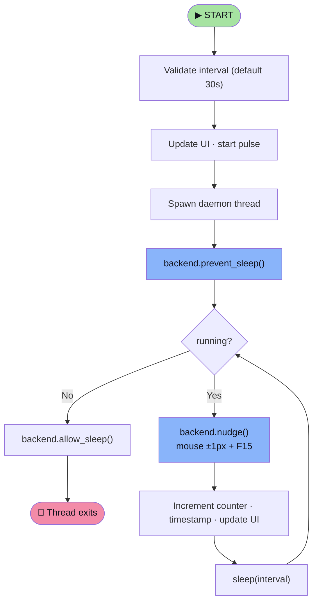
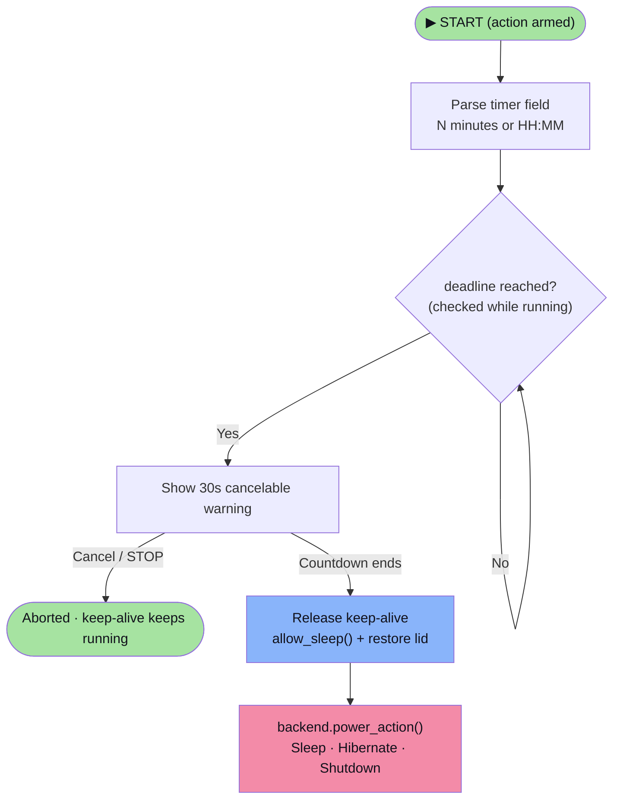

# Architecture

The UI is platform-agnostic; every OS-specific behaviour lives behind a small
backend interface chosen at runtime. Adding a platform means writing one class.

---

## System overview



---

## Keep-alive flow



The loop runs on a **daemon** thread so it can never keep the process alive
after the window closes. All UI updates are marshalled back to the Tk main
thread with `root.after(0, ...)`.

---

## Scheduled power action



The countdown uses Tk's `after()` on the main thread — no extra thread, and it
stops cleanly whenever `running` becomes false.

---

## The backend contract

`KeepAwakeBackend` is an ABC with three required methods and three optional
capability hooks:

| Member | Kind | Purpose |
|---|---|---|
| `prevent_sleep()` | **required** | Ask the OS to keep system + display awake |
| `allow_sleep()` | **required** | Restore default power/idle behaviour |
| `nudge()` | **required** | Emit a tiny, invisible input event |
| `prevent_lid_sleep()` | optional | Override lid-close action; returns `bool` |
| `restore_lid_sleep()` | optional | Put the lid-close action back |
| `power_action(action)` | optional | Sleep / Hibernate / Shut down |
| `close()` | provided | Calls `restore_lid_sleep()` + `allow_sleep()` |

Capabilities are advertised as class attributes so the UI can adapt without
platform checks:

```python
lid_close_supported: bool = False
power_actions: tuple[str, ...] = ()
```

The UI only renders the lid-close checkbox when `lid_close_supported` is true,
and only builds the power-action menu from `power_actions` — which is why macOS
never shows *Hibernate*.

`get_backend()` reads `sys.platform` **at call time**, which keeps it trivially
monkeypatchable in tests.

---

## Project structure

```text
do-not-lock-my-system/
├── src/dontlockpc/
│   ├── __init__.py           # package metadata / version
│   ├── __main__.py           # `python -m dontlockpc`
│   ├── app.py                # Tkinter UI + keep-alive orchestrator
│   ├── autostart.py          # cross-platform "run at login" management
│   ├── tray.py               # system-tray wrapper (graceful degradation)
│   └── backends/
│       ├── __init__.py       # get_backend() platform factory
│       ├── base.py           # KeepAwakeBackend abstract interface
│       ├── windows.py        # Win32 ctypes implementation
│       └── macos.py          # caffeinate + Quartz implementation
├── tests/
│   ├── test_backends.py      # backend factory + contract + capabilities
│   ├── test_power.py         # power-timer deadline parser
│   └── test_power_actions.py # cross-platform power actions + dialog
├── docs/                     # this documentation site (MkDocs)
├── .github/workflows/        # CI, release, PyPI publish, docs
├── dontlockpc.spec           # PyInstaller build spec
└── pyproject.toml            # packaging + tooling config
```

---

## Design principles

- **No platform checks in the UI** — capabilities are advertised by the backend.
- **Always restore what you change** — lid-close settings and execution state
  are put back on STOP, exit, and before any power action.
- **Fail soft** — an unavailable tray, autostart, or optional capability
  degrades gracefully instead of crashing.
- **Nothing leaves the machine** — no network calls, no telemetry.

---

**Next:** [Python API :material-arrow-right:](api.md){ .md-button }
