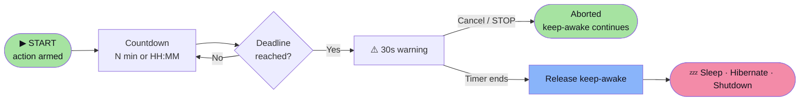

# Usage

  

The whole app is one window. Set your options, press **START**, and walk away.

---

## Controls

| Control | What it does |
|---|---|
| **▶ START** | Begins sending keep-alive signals at the configured interval |
| **⏹ STOP** | Halts signals and restores default power/idle behavior |
| **Interval** | Signal frequency in seconds (default `30`, editable when stopped) |
| **Then … after …** | Schedules Sleep / Hibernate / Shutdown once the time elapses |
| **Stay awake even with the lid closed** | Windows: keeps the system awake when the lid is shut |
| **Start automatically at login** | Toggles autostart (Windows `Run` key / macOS LaunchAgent) |
| **Close (✕)** | Exits the app |
| **Minimize (—)** | Windows: hides to the system tray · macOS: minimizes to the Dock |

The status card shows a live pulse, a **signal counter**, and the **timestamp**
of the last keep-alive signal so you can confirm it's working.

---

## Basic keep-awake

1. Launch the app.
2. (Optional) Change **Interval** — 30 seconds suits almost every setup.
3. Press **START**. The status turns green and reads **ACTIVE**.
4. Run your agent / build / job and walk away.
5. Press **STOP** when you're done to restore normal power behaviour.

!!! tip "Pick an interval below your lock timeout"
    The interval must be **shorter than your screen-lock timeout**, otherwise
    the machine can lock between signals. If your policy locks after 1 minute,
    use `30` or less.

---

## Keeping the lid closed (Windows)

Tick **“Stay awake even with the lid closed”** before pressing START.

While running, the app temporarily sets the active power plan's *lid close
action* to **Do nothing**, then **restores your original setting** on STOP or
exit.

!!! warning "macOS clamshell sleep"
    On macOS, closing the lid triggers firmware-level sleep that an app cannot
    override. It can only be disabled system-wide with
    `sudo pmset -a disablesleep 1` (and re-enabled with `0`) — so the app
    deliberately does **not** change it for you. The checkbox is hidden on
    macOS.

---

## Scheduled power action

Perfect for *“keep my PC awake for the agent, then shut it down when it's
finished.”*

1. Set **Then** to `Sleep`, `Hibernate` (Windows only), or `Shutdown`.
2. Set **after** to either:
    - a **number of minutes** — e.g. `90`
    - a **24-hour clock time** — e.g. `23:30` (the next occurrence)
3. Press **START**.

When the deadline is reached, a **30-second cancelable warning** appears. If you
don't cancel it, keep-awake is released first (so the OS can actually power
down) and the action runs.

**Supported actions by platform**

| Action | Windows | macOS |
|---|:---:|:---:|
| Sleep | ✅ | ✅ |
| Hibernate | ✅ | ➖ *(not a macOS feature)* |
| Shutdown | ✅ | ✅ |

Cancelling is easy: click **Cancel** in the warning dialog, or press **STOP**
at any point before it fires to disarm the timer entirely.

!!! note "Invalid or blank timer"
    A blank or unparseable value simply **disarms** the timer — keep-awake runs
    normally and nothing is powered off.

---

## Start at login

Tick **“Start automatically at login”** and the app registers itself with your
OS:

- **Windows** — a value under `HKCU\...\CurrentVersion\Run`
- **macOS** — a LaunchAgent `.plist` in `~/Library/LaunchAgents/`

Unticking removes it. If the OS rejects the change, the checkbox reverts so it
always reflects reality.

!!! info "Autostart launches the app, not keep-awake"
    The window opens at login but **does not** press START for you — you stay in
    control of when your machine is held awake.

---

## System tray (Windows)

Minimizing sends the app to the tray. Right-click the tray icon for
**Show**, **Start**, **Stop**, and **Exit**.

On macOS, `pystray`'s backend must own the main thread, which conflicts with
Tkinter — so the app minimizes to the **Dock** instead of a menu-bar item.

---

**Next:** [Features in depth :material-arrow-right:](features.md){ .md-button }
